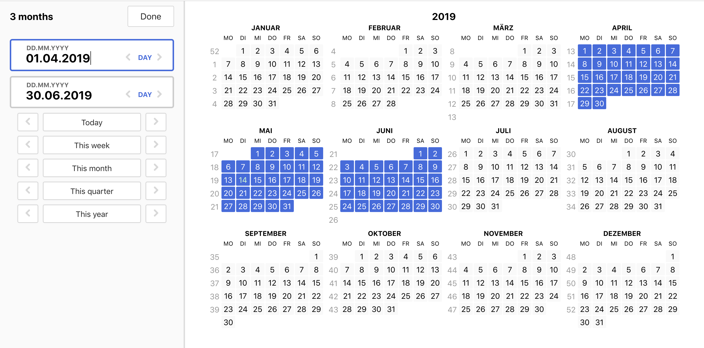

# react-dateranger

An opinionated full-screen approach to date picking

## Demo

https://react-dateranger.netlify.com/

## Status & Next steps

Status: Right now, this is just a create-react-app that explores date picking

Next steps:

- extract a date picking component, move create-react-app to `examples`
- publish to npm
- make component customizable

### `npm start`

Runs the app in the development mode. 
Open [http://localhost:3000](http://localhost:3000) to view it in the browser.

The page will reload if you make edits. 
You will also see any lint errors in the console.

## Contributing

Contributions are welcome.

## License

[MIT](README.md)

